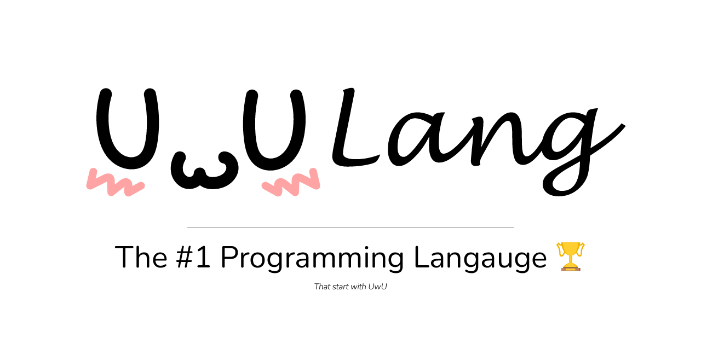

# UwULang

[](https://uwulang.vercel.app/)

[](https://github.com/UwULang/uwulang/actions/workflows/sanity_check.yaml) [](https://opensource.org/licenses/MIT) 

The soon to be #1 programming language in the world. It is a turing-complete language modelled after the measured UwUness of a programming language called BrainFuck. Check out the [website](https://uwulang.vercel.app/) for more info! Alternatively, check out the [documentation](https://uwulang-docs.vercel.app/) for more info.

## Try it Out

### Install

If you are on Debian or Ubuntu, you can install the package from the [release](https://github.com/UwULang/uwulang/releases) and do `sudo apt install ./uwulang_<VERSION_NUMBER>_all.deb` replacing `<VERSION_NUMBER>` with the version number of the release.

Otherwise you can build it from source. First clone the repo:

```bash
git clone https://github.com/UwULang/uwulang.git
```

Then run

```bash
make install
```

to install the package to your local machine. This will install the `uwulang` binary to your local machine and a man page for the `uwulang` command. (requires make and gcc)

### Only Build Locally

Running it by first building it in c with `make` or just use `gcc src/main.c -Wall -std=c99 -o uwulang`. Once you have the binary, if you provide a file as the first arg, it will take the contents of the file and run UwULang on it:

```bash
./uwulang test/hellOwOrld.uwu
```

Otherwise if you provide no args, it will launch into the UwULang shell interpreter.

```bash
./uwulang
```

## Usage

The interpreter is a command-line program that reads a UwULang script from a file or from standard input and executes it. The interpreter should be able to be invoked with the command `uwulang`. with no arguments provided

That will launch you into an interactive interpreter. The interpreter should print a prompt starting with `> `, and then read a line of input from standard input. The interpreter should then execute the line of input as a UwULang program. The interpreter should then print the prompt again and read another line of input. This process should continue until the user does Ctrl-C or Ctrl-Z. The interpreter should then exit.

To run a UwULang script from a file, you can run `uwulang <filename>`. The interpreter should then execute the script in the file and exit.

By using the `-v` flag, you can get the version of UwULang
Using the `-h` flag, you can get the help menu

There is also a helpful man page! You can access it by running `man uwulang`

## Instructions

- 👆 - increment
- 👇 - decrement
- 👉- go right
- 👈- go left
- 🥺- print char
- 😳- get char
- 🥴- random short
- 😒- jump to 😡 if curr == 0
- 😡- jump back to 😒 if curr != 0

\*definitely not just [brainfuck](https://esolangs.org/wiki/Brainfuck) with extended functionality that you can use [uwufier](https://github.com/Zeyu-Li/uwufier) conversion tool

## Specification file

If you want to implement UwULang, you can use the specification file `uwulang.md`

### Hello World

Print Hello World to the console

```uwu
👆👆👆👆👆👆👆👆😒👉👆👆👆👆😒👉👆👆👉👆👆👆👉👆👆👆👉👆👈👈👈👈👇😡👉👆👉👆👉👇👉👉👆😒👈😡👈👇😡👉👉🥺👉👇👇👇🥺👆👆👆👆👆👆👆🥺🥺👆👆👆🥺👉👉🥺👈👇🥺👈🥺👆👆👆🥺👇👇👇👇👇👇🥺👇👇👇👇👇👇👇👇🥺👉👉👆🥺👉👆👆🥺
```

### First 10000 square numbers

Print the first 10000 square numbers

```uwu
👆👆👆👆😒👉👆👆👆👆👆👈👇😡👉😒👈👆👆👆👆👆👉👇😡👆👈👆😒👉😒👉👆👉👆👈👈👇😡👆👆👉👉😒👈👈👆👉👉👇😡👉👉👉😒👇😡👆👆👉😒👇😡👆👉👉👉👆😒😒👇😡👆👆👆👆👆👆👉👉👉😡👈👈👈😒😒👈👆👆👆👆👆👆👆👆👈👆👆👉👉👇😡👆👈🥺👈😒👉👇👇👇👇👈👇😡👈😡👈👈😒👉👉👉👉👉😒👉👉👉😒👇😡👆👆👆👆👆👆👆👆👆👈😒👉👇👈👇😡👆👆👆👆👆👆👆👆👆👉😒👇😒👈👇👉👇😡👆😒👈👈👈😡😡👈😒👉👆👈👇😡👉😡👈👈👇😡👈👈👇😡
```

### E (transcendental number)

Prints digits of the transcendental number e (this program is non terminating ie it will run forever for ever greater precision)

```uwu
👉👉👉👉👆👆👉👆👉👆👆👉👆👉👉👆👆👈👆😒😒👉😒👉👉😒👉👉👉👉😡👈👈👈👈😒😒👉👉👉👉👆👈👈👈👈👇😡👈👈👈👈😡👉👉👉👉👉👉😡👆👈😡👉👇👉👉👇👇😒👆😒👆👆👆👈👈👈👈👇👇😡👆👆👉👉👉👉👇👇😡👆😒👉👉👉👉😡👈👈👈👈😒👈👈👆👈👆👈😡👈👈😒👉👉👉👉👉👉😒😒👈👈👈👈👆👉👉👉👉👇😡👉👉👉👉😡👈👈👈👈👈👈👈👈😒👈👈👈👈😡👉👉👇😒👈👈👆👉👉👇😡👆👈👈😒👇👉👉👉👉😒👇😒👆👉👉👉👉👇😡👇👈👈👇😒👉👉👉👉👇😡👆👆👉👉👆😒👇👈👈👈👈👆😡👆👉👉👉👉😡👈👈👈👈😒👈👈👈👈😡😡👉😒👇😒👈👆👉👇😡😡👆👈😒👇👉👉👉👉😒👇😒👆👉👉👉👉👇😡👇👈👈👈👇😒👉👉👉👉👇😡👆👆👉👉👉👆😒👇👈👈👈👈👆😡👆👉👉👉👉😡👈👈👈👈😒👈👈👈👈😡😡👈👈😡👉👉👉👆😒👉👉👉👉😡👇😒👆👈👈👈👈👇👇😡👆👆😒👈👈👈👈😡👉👉👉👆😒👉👇😒👉👉😒👇👇😒👆👆👉👉👆👉👉👇👇😡👇👈😒👇😒👇😒👆👆👆👈👈👈👈👇😡👆👉👉👉👉👇😡😡👆👆👉👆😒👇👈👈👈👈👆😡👆👆👉👉👆👉👉😡👈👈😒👉😒👈👇👈👈👈😡👆👈😡👉👇👉👉👉😡👆👉😒👉👉👉👉😡👇😒👆👈👈👈👈👇👇😡👆👆👈😒😒👉👉👉👉😡👈👈👈👈😒👇😒👆👉😒👈👇👉👇😡👆👆👈😒😒👉👇👈👇😡👆👆😒👈👈👈👈😡👆👉👉👆👉👉👇😡👆👆👈👈👈👈👇😡👉👇😒👆😒👈👆😒👈👈👈👈😡👉😡👈👆👉😡👆👈😒👇👉👇👉👉👉😒👇😡😡👆👈👈👈👈😡😡👉😒👈👈👈👈😡👉😒👇😒👇😒👆👆👆👆👆😒👉👆👆👆👆👆👆👆👆👈👇😡👉👇🥺👉👉👉👇😒👈👈👈👇👇👇👇🥺👈😡👈😒👈👈😡👉👉😒👇😡👉👇👉👉👆😒😒👉👉👉👉😡👆😒👇😒👇👉👉👉👉👆👉👉👉👉👉👉👉👉👇😒👇😒👆👆👆👈👈👈👈😒👇😡😡👆👉👉👉👉👇😡👆👆😒👈👈👈👈😡😡👆👈👈👈👈😡👉👉👉😡👆👈👆👈👈😡👉😒👇😒👇👉😒👇👇😒👆👆👉👉👉👉👇👇😡👇👉😒👇😒👇😒👆👆👆👈👈👈👈👇😡👆👉👉👉👉👇😡😡👆👆👈👆😒👇👈👈👈👈👆😡👆👆👉👉👉👉😡👈👈👈👈😒👉😒👈👈👈👈😡👆👈😡👉👇👉👉😡👈😡👉👉👉👉😒👇👇😒👆👆👉👉👉👉👇👇😡👇👈👇👇😒👆👆👆👉👉👉👉👇👇😡👆👉👆😒👇👈👈👈👈👆😡👆👆👉👉👉👉😡👈👈👈👈👈😒👈👈👈👈😡👈😡👉😒👉👆👈👈👆👆👈😡👈😡👉😒👆👉😒👇👇😒👆👆👉👉👉👉👇👇😡👇👉👇👇😒👆👆👆👉👉👉👉👇👇😡👆👈👆😒👇👈👈👈👈👆😡👆👆👉👉👉👉😡👈👈👈😒👈👈👈👈😡😡👉👉😡👉😡
```

## Conversion

If you want to convert bf files to UwU files use the [Transpiler](https://uwulang.vercel.app/transpiler) or [UwUfier](https://github.com/UwULang/uwufier) written in Golang

## Thanks

Thanks to [Daniel Cristofani](http://www.hevanet.com/cristofd/) who created Brainfuck!

### Sponsors

Our sponsors are the best! [Become a sponsor](https://github.com/sponsors/UwULang)

- [Exanut](https://github.com/Exanut)

## License

[](https://opensource.org/licenses/MIT)
